# 实现无人值守的Ubuntu安装


# 软件环境
* Virtualbox
  安装Virtualbox（window系统 不能创建64位 需要虚拟化）
* Ubuntu 18.04 Server 64bit

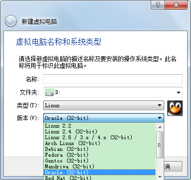
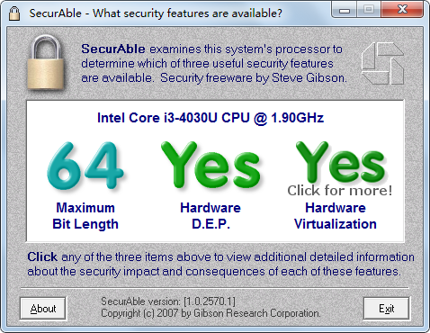


# 实验步骤
  -------------------


# 网络配置
* 先「有人值守」方式安装好 **一个可用的 Ubuntu 系统环境**
开启NAT和Host-Only两个网卡
* 命令行直接配置
```
  # 查看所有网卡
  ifconfig -a

  # 查看未开启的网卡
  diff <(ifconfig -a) <(ifconfig)

  # 启用第二块网卡
  sudo ifconfig enp0s8 up

  # 获取ip等信息
  sudo dhclient enp0s8

  # 查看网卡
  ifconfig | grep "enp0s8" -A 9
```
```
  # 打开配置问价增加新网卡信息（这里因为权限不足通过w !sudo tee % 修改的
  sudo vi /etc/netplan/01-netcfg.yaml
  # 启用配置
  sudo netplan apply
```
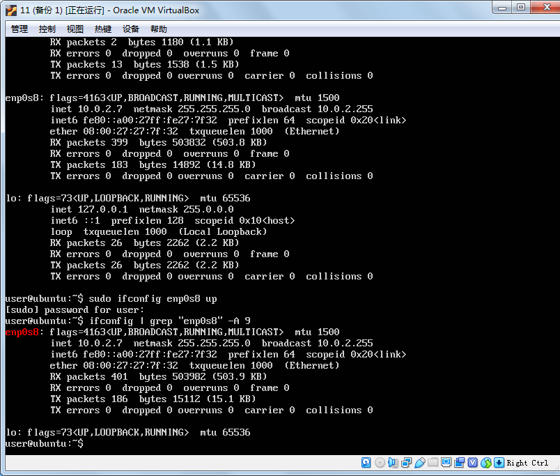
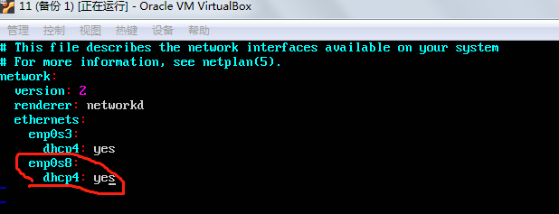

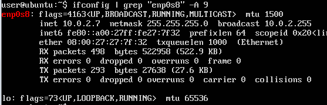

ssh 远程登录需要用192.168.56.107

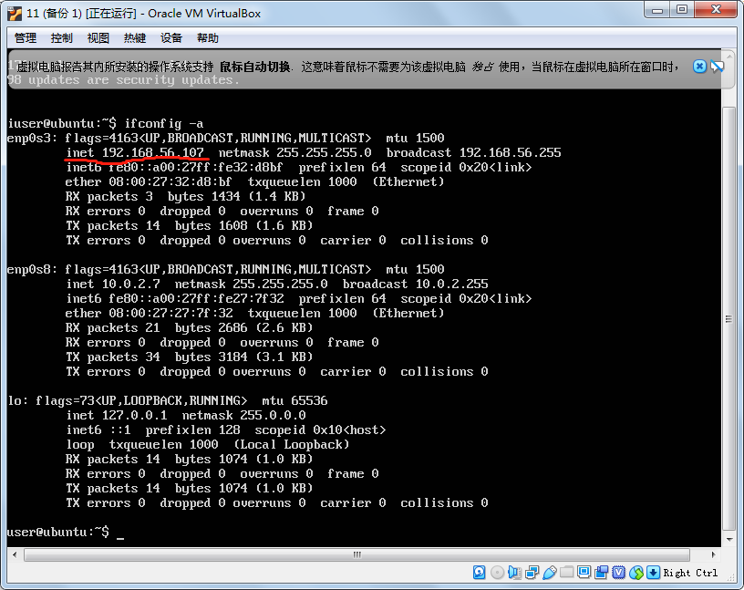


# 远程连接配置
在服务器上安装openssh-server
  * 安装完成后默认启用
  
  ```
    #更新源
    sudo apt update
    #安装OpenSSH 服务器应用
    sudo apt install openssh-server
    # 在本地进行远程连接
    ssh user@192.168.56.107

  ```
  远程免密登录
  
  
   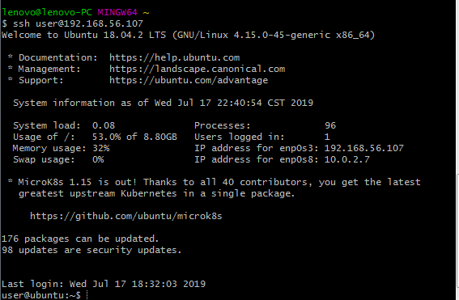
  
# ssh免密登录
  在本地windows主机上使用git bash
    * 生成秘钥：'ssh-keygen -t rsa -f .ssh/id_rsa' 
    * 将公钥发送给服务器：'ssh-copy-id -i .ssh/id_rsa.pub user@192.168.56.107'
    * 免密登录:ssh user@192.168.56.107
    
    
    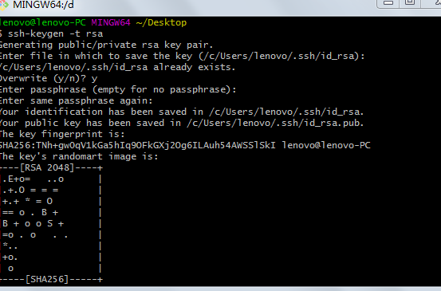
    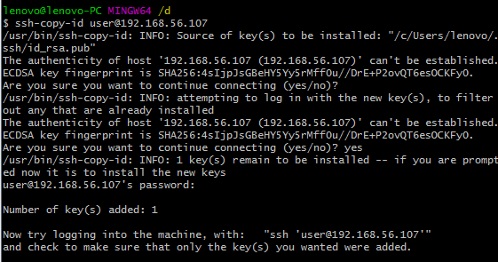
 
# 定制镜像

---

## 实现特性

* 定制一个普通用户名和默认密码
* 定制安装OpenSSH Server
* 安装过程禁止自动联网更新软件包
```
  # 在当前用户目录下创建一个用于挂载iso镜像文件的目录
   mkdir loopdir

  # 上传本地iso镜像文件
  # Windows git-bash （或者cmder）
  scp ubuntu-18.04.2-server-amd64.iso user@192.168.56.107:~
  
  # 挂载iso镜像文件到该目录
  # -o loop 用来把一个文件当成硬盘分区挂接上系统
  # ubuntu-18.04.2-server-amd64.iso 设备文件名
  # loopdir 挂载点
  sudo mount -o loop ubuntu-18.04.2-server-amd64.iso loopdir
  # mount: /home/user/loopdir: WARNING: device write-protected, mounted  read-only.

  # 创建一个工作目录用于克隆光盘内容
  mkdir cd
 
  # 同步光盘内容到目标工作目录
  # 一定要注意loopdir后的这个/，cd后面不能有/
  # -a, --archive 归档模式，表示以递归方式传输文件，并保持所有文件属性
  # -v, --verbose 详细模式输出
  rsync -av loopdir/ cd

  # 卸载iso镜像
  sudo umount loopdir

  # 进入目标工作目录
  cd cd/

  # 编辑Ubuntu安装引导界面增加一个新菜单项入口
  # 修改配置以识别 ubuntu-server-autoinstall.seed
  sudo vi isolinux/txt.cfg

  # 在文件中添加以下内容
  # 强制保存 (这里强制保存还是保存不上 用sudo chmod 修改的权限)
  label autoinstall
  menu label ^Auto Install Ubuntu Server
  kernel /install/vmlinuz
  append  file=/cdrom/preseed/ubuntu-server-autoinstall.seed debian-  installer/locale=en_US console-setup/layoutcode=us keyboard-configuration/layoutcode=us console-setup/ask_detect=false localechooser/translation/warn-light=true localechooser/translation/warn-severe=true initrd=/install/initrd.gz root=/dev/ram rw quiet

  # 修改配置缩短超时等待时间
  # timeout 10
  sudo vi isolinux/isolinux.cfg

```
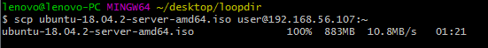
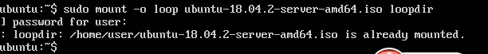

使用预置的文件在，配置安装时的默认选择


```
  # 上传 ubuntu-server-auto install.seed
  # Windows git-bash （从宿主机上传到虚拟机）
  scp ubuntu-server-autoinstall.seed mosom@192.168.56.102:~

  # 移动到指定目录下
  sudo mv ubuntu-server-autoinstall.seed ~/cd/preseed/

  # 重新生成md5sum.txt
  find . -type f -print0 | xargs -0 md5sum > /tmp/md5sum.txt
  sudo mv /tmp/md5sum.txt md5sum.txt

  # 无 mkisofs 命令（提示安装genisoimage）
  mkisofs --help

  # 查找并安装相应的软件包
  apt-cache search mkisofs
  sudo apt install genisoimage

  # 以下为 bash 脚本，保存为 gen_iso.sh
  # 封闭改动后的目录到.iso（中间不能有回车空行 否则会不成功）
  IMAGE=custom.iso
  BUILD=~/cd/
  mkisofs -r -V "Custom Ubuntu Install CD" \
              -cache-inodes \
              -J -l -b isolinux/isolinux.bin \
              -c isolinux/boot.cat -no-emul-boot \
              -boot-load-size 4 -boot-info-table \
              -o $IMAGE $BUILD

  # 执行脚本以生成镜像文件
  sudo bash gen_iso.sh 
```
生成镜像 可以无人值守自动安装
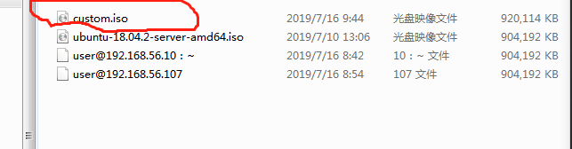

无人值守安装完成 可以用预设密码登录 

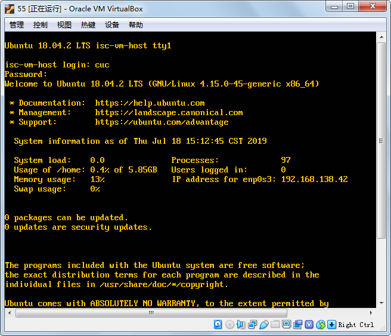


# 参考资料
https://github.com/CUCCS/linux-2019-jckling/tree/master/0x01
https://jingyan.baidu.com/article/335530daa55d7e19cb41c3c2.html
https://www.bilibili.com/video/av23555464

